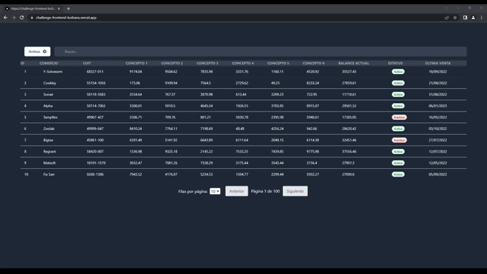

<div align="center">
  <h1>Frontend Challenge Koibanx</h1>
  <h3>Challenge Frontend - Table with Searchbar with Nexjs - <a>https://challenge-frontend-koibanx.vercel.app/</a></h3>

<br />

<h3>CsarChvz Linkedin</h3> <a href="https://github.com/trpc/trpc/blob/main/LICENSE">
<a href="https://www.linkedin.com/in/csarchvz/" target="_blank"></a>
<br />
<br />

## 🔥 Developed in


<br />
<br />

## 🚀 Preview

  <figure>
    
    <figcaption>
      <p align="center">
        Table and SearchBar that shows data, search, order and filter the data.
      </p>
    </figcaption>
  </figure>
</div>

## 🛠 Development Setup

First, run the installation dependecies:

```bash
npm i
# or
yarn add package.json
```

Run the development server:

```bash
npm run dev
# or
yarn dev

```

Open [http://localhost:3000](http://localhost:3000) with your browser to see the result.

## 🧑‍💻 Developer

  <figure>
    <div class="image-container">
    
    
</div>
    <figcaption>
      <h1 align="center">
        César Chávez
      </h1>
    </figcaption>
  </figure>
